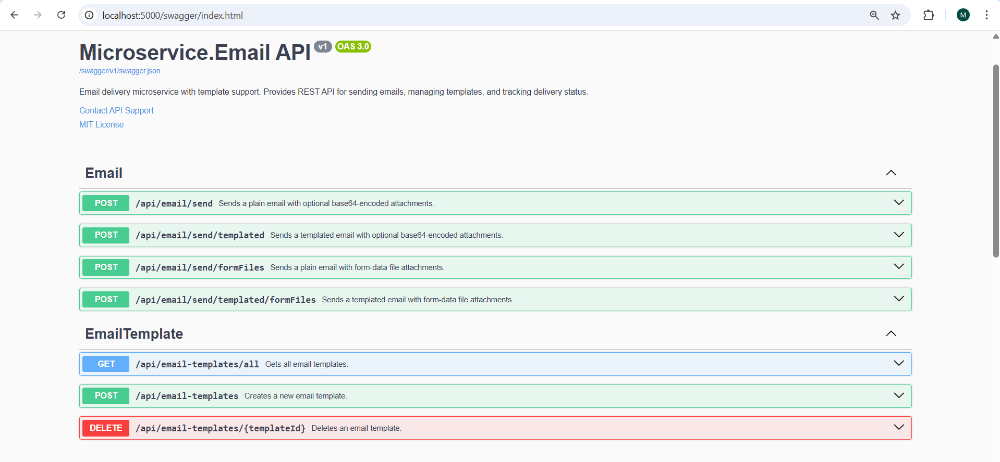
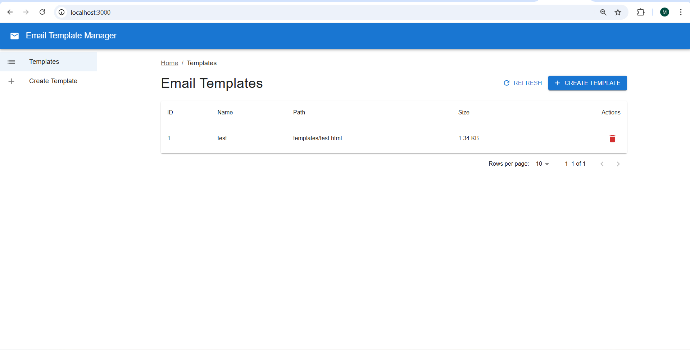
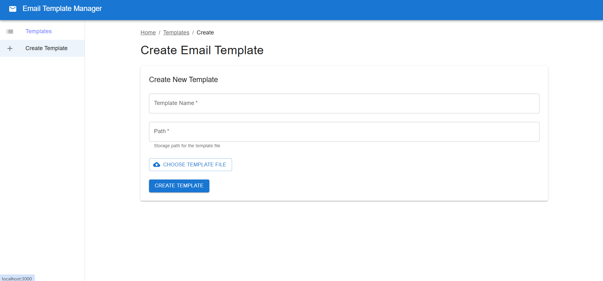
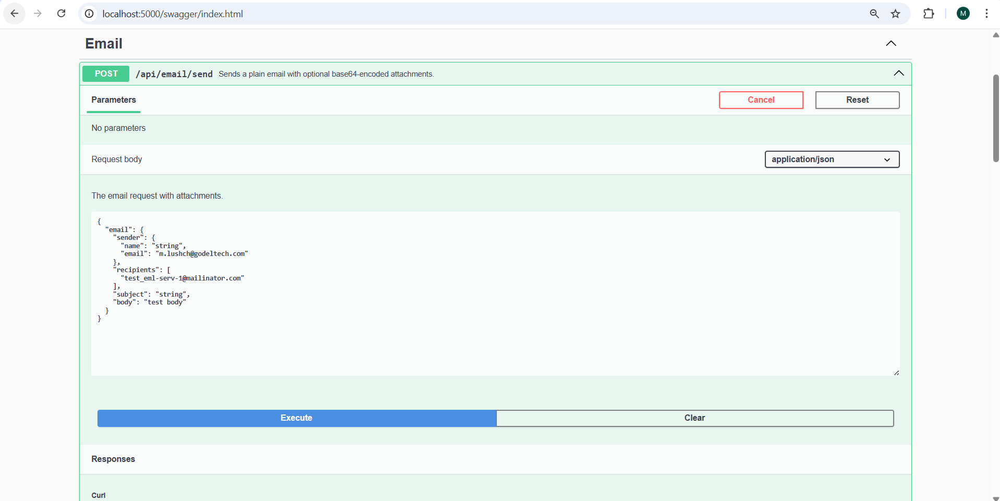
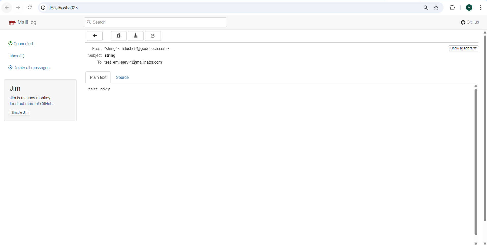

# Microservice.Email

Used AI-assisted tooling:
1. GPT-5.2 - for creating tasks from project documentation, readme(s)
2. Claude Haiku 4.5 - used as a lightweight solution to perform small tasks such as contracts and models creation
3. Claude Opus 4.5 - for building project codebase, covering project by unit tests
4. Used code review tools provided by Copilot.
5. Used GitHub MCP Server to resolve some pipeline issues.

Step by step project workflow:

1. Created empty public repository Microservice.Email.
2. Used VS Code Copilot integration to generate .gitignore file. Prompt (used model GPT-5.2): Create .gitignore file in project root directory. Use .NET + React TS stack for a .gitignore file.
3. Created technical, contracts, codestyle documentation by myself to define project boundaries and the domain area.
4. Created a list of tasks for implementing application functionality with the support of AI tools.
5. Started implementation using AI tools. Example prompt: Implement task 1_setup_project_structure.md from the task list. Create a branch with the task name. After making changes, commit them, push the branch, and create a pull request targeting the main branch. Ensure that project build works after changes.
6. Went through all the tasks using AI tools.
7. Resolved some configuration issues, applied refactoring, and tested the application manually to ensure everything worked correctly.

## Screenshots

### API Documentation (Swagger)
The backend exposes a comprehensive REST API documented via Swagger/OpenAPI. This interface allows developers to explore and test all available endpoints for sending emails and managing templates.

### Templates Management Page
The React frontend provides a template management interface where users can view all existing email templates stored in MinIO, including their names and sizes.

### Create Template Page
Users can create new email templates by uploading HTML files with Scriban syntax. The templates are stored in MinIO and can be used for sending templated emails.

### Send Email Interface
The application provides an interface for composing and sending emails with support for attachments. Emails can be sent directly or using predefined templates.

### Received Email Example
An example of an email received through the Microservice.Email system, demonstrating the rendered output from the email delivery pipeline.

